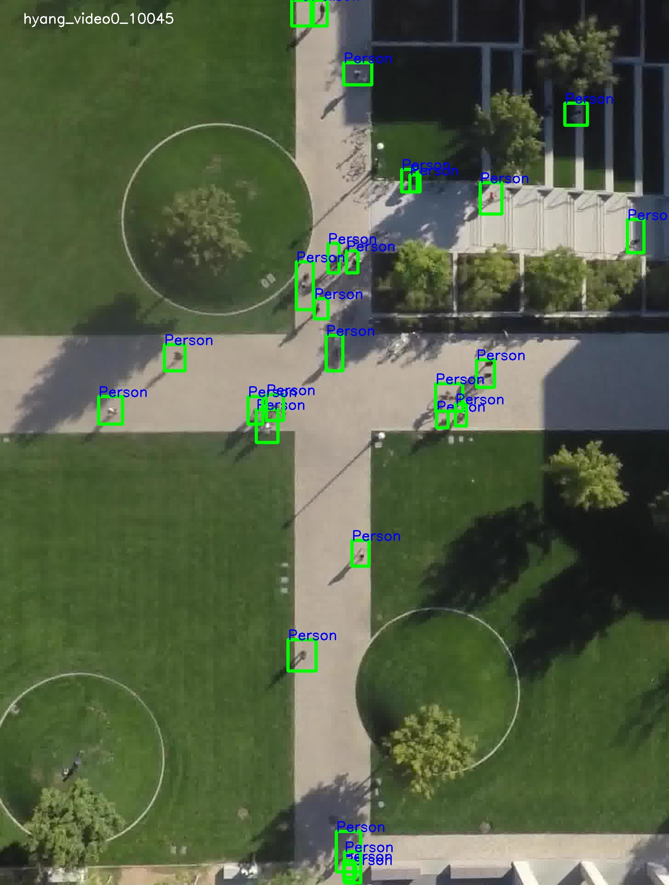

# Visualize Voc Dataset
A simple utility python application to visualize pascal voc (format) dataset images with bounding boxes. Useful to check whether there is any error in forming annotation files.



## Requirements
- CV2
- BeautifulSoup4

## How to run

```bash
python main.py --root_dir [PASCAL VOC (format) dataset root directory] --type train
```

#### Keyboard Input Usage
- a: previous image
- d: next image
- s: random image
- q: quit program
